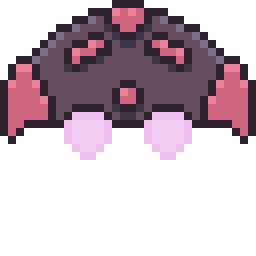
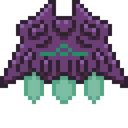
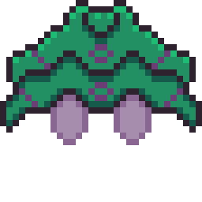
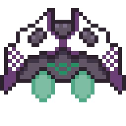
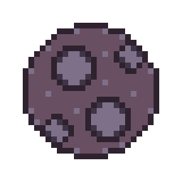
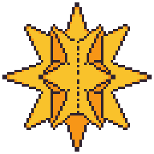

# 'Orbital Arousal'

Juego desarrollado mediante la herramiente PixiJS, para la materia 'Programación de Videojuegos I' de la carrera 'Tecnicatura Universitaria en Programación de Videojuegos' de la 'Universidad Nacional de Hurlingham'.

# Controles:

- 'A' | 'D' para orbitar alrededor de la estrella.
- 'ESPACIO' para disparar. (Se puede mantener presionado)
- 'CONTROL' para abrir el menú de compra, que permite agregar una nave a la flota (opción superior) o aumentar la cadencia de disparo (opción inferior).
- 'SHIFT' para mantener el disparo constante sin necesidad de tener pulsada la tecla 'ESPACIO'.
- 'LEFT MOUSE' para eliminar naves/asteroides.

# Comportamiento de los objetos:

## Player

- Orbita alrededor de la estrella.
- Puede disparar.
- Mediante el click puede lazar un rayo desde la estrella que elimina a los enemigos.
- Puede añadir naves a su flota y/o mejorar la cadencia de disparo.

## Normal (Enemy)

- Se mueve hacia la estrella.
- Puede colisionar con la estrella.
- Puede ser eliminado tanto con disparos como con el click de mouse.

## Doge (Enemy)

- Se mueve hacia la estrella.
- Puede colisionar con la estrella.
- Puede esquivar proyectiles.
- Solo puede ser eliminado mediante el click.

## Comander (Enemy)

- Se mueve hacia la estrella.
- Agrupa las naves a su alrededor.
- (AGREGAR LO QUE FALTE).

## Asteroid

- Se mueve evitando la estrella.
- Da créditos que se pueden utilizar para comprar mejoras.
- Solo puede ser eliminado mediante el click.

## Star

- Pierde un punto de vida cada vez que una nave colisiona con ella.
- Puede ser destruida, finalizando el juego.

# Objetivos:

- Defender la estrella de las naves invasoras.
- Alcanzar la mayor cantidad de puntos posibles.

# Integrantes:

- Ariel Aguilar
- Diego Longo
- Carlos Ibarra